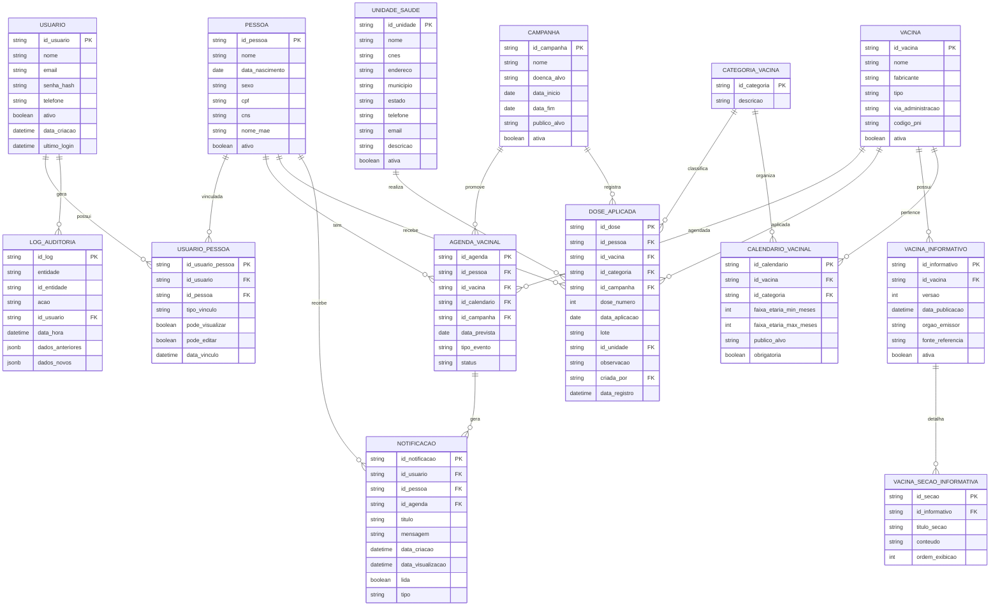

# 📌 LocVac – Plataforma Digital de Gestão e Acompanhamento Vacinal

O **LocVac** é uma solução tecnológica voltada para a modernização do acompanhamento vacinal. Através de uma plataforma mobile, o projeto visa centralizar informações, automatizar alertas e fornecer conteúdo confiável sobre imunização, seguindo as diretrizes do **Programa Nacional de Imunizações (PNI)**.

---

## 📖 Sobre o Projeto

O projeto surge como uma resposta à necessidade de digitalizar a tradicional carteira de vacinação física. A plataforma permite que usuários gerenciem não apenas seu próprio histórico, mas também o de seus dependentes, integrando:
- Registro digital de doses aplicadas.
- Agenda inteligente de doses futuras.
- Notificações automatizadas para evitar atrasos.
- Conteúdo técnico validado para combater a desinformação.

## 🎯 Objetivos Principais

- **Digitalização:** Organizar o histórico vacinal individual e familiar em um ambiente seguro.
- **Engajamento:** Aumentar a cobertura vacinal através de alertas e lembretes proativos.
- **Educação:** Oferecer informações técnicas sobre vacinas, contraindicações e esquemas de doses.
- **Padronização:** Estruturar dados em conformidade com as políticas públicas de saúde brasileiras.

---

## 🚀 Funcionalidades Principais

| Categoria | Descrição |
| :--- | :--- |
| **Gestão de Perfis** | Cadastro de usuários e gerenciamento completo de dependentes. |
| **Carteira Digital** | Registro histórico de todas as doses aplicadas. |
| **Agenda Inteligente** | Cálculo automático de datas para próximas doses e reforços. |
| **Alertas e Avisos** | Notificações *in-app* sobre campanhas, doses próximas ou em atraso. |
| **Central de Informação** | Guia completo sobre indicações, contraindicações e reações adversas. |
| **Auditoria e Logs** | Histórico de notificações e status de leitura para controle do usuário. |

---

## 🛠️ Tecnologias e Metodologia

### Stack Tecnológica
- **Backend:** Spring Boot (Java 17)
- **Frontend:** React Native (JavaScript)
- **Banco de Dados:** PostgreSQL
- **Design/Prototipação:** Figma

### Metodologia de Desenvolvimento
O desenvolvimento segue uma abordagem estruturada em camadas, garantindo escalabilidade e segurança:
1. **Levantamento de Requisitos:** Questionários com o público-alvo e análise do PNI.
2. **Modelagem:** Elaboração de diagramas de caso de uso, classes e banco de dados.
3. **Desenvolvimento:** Implementação paralela das camadas de banco de dados, API e interface mobile.
4. **Validação:** Testes pilotos simulando cenários reais em unidades de saúde.

---

## 📅 Cronograma de Atividades

| Atividade | 2025 (2º Sem) | 2026 (1º Sem) |
| :--- | :---: | :---: |
| Elucidação de requisitos e pesquisa bibliográfica | ✅ | |
| Análise de produtos similares e do PNI | ✅ | |
| Modelagem do sistema e Prototipação (UI/UX) | ✅ | ✅ |
| Desenvolvimento do Backend e Banco de Dados | | ✅ |
| Desenvolvimento do Frontend Mobile | | ✅ |
| Testes de pequena escala e Implementação | | ✅ |

---

## 🗄️ Modelagem do Banco de Dados

Abaixo, apresentamos a estrutura relacional do banco de dados PostgreSQL utilizada no projeto.

---

## 👥 Equipe de Desenvolvimento

- **Anilson Goes Lima**
- **Glória Maria Pianheri**
- **João Vitor Vale da Cruz**
- **Maria Clara Pirani Neves**

## 📚 Referências Bibliográficas

- **CASCIARO, Mario; MAMMINO, Luciano.** *Node.js Design Patterns* (2020).
- **DABIT, Nader.** *React Native in Action* (2019).
- **DOMINGUES, Carla et al.** *46 anos do Programa Nacional de Imunizações* (2020).
- **YAHIAOUI, Houssem.** *Firebase Cookbook* (2017).
